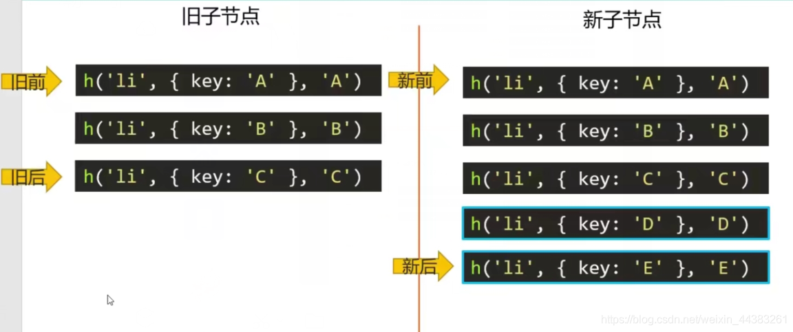
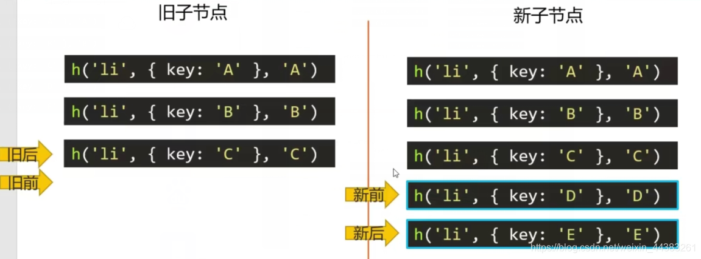
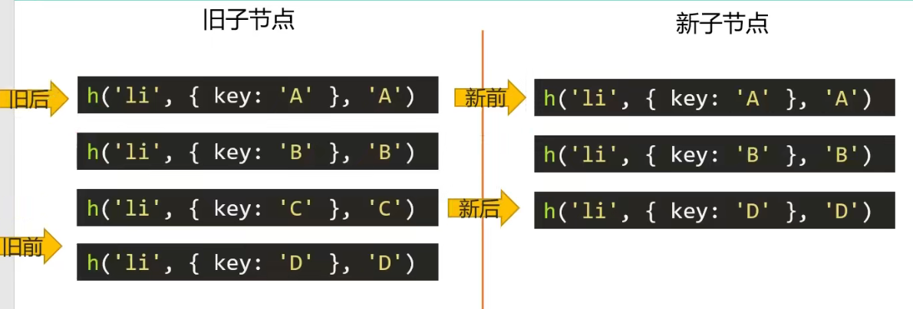
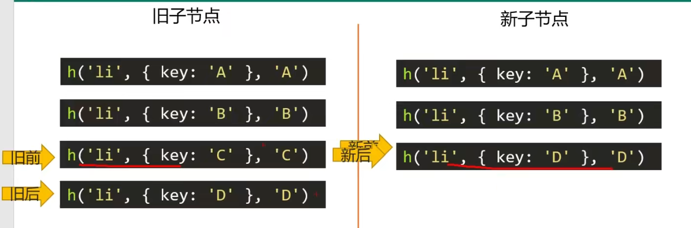
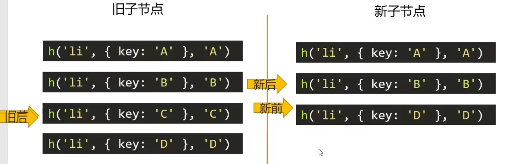
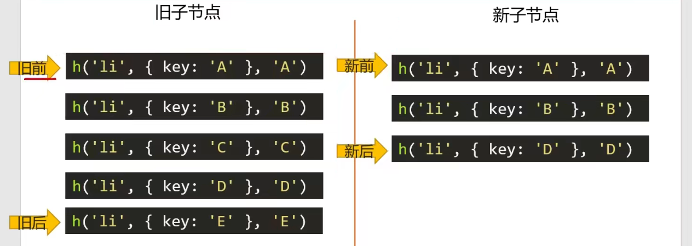
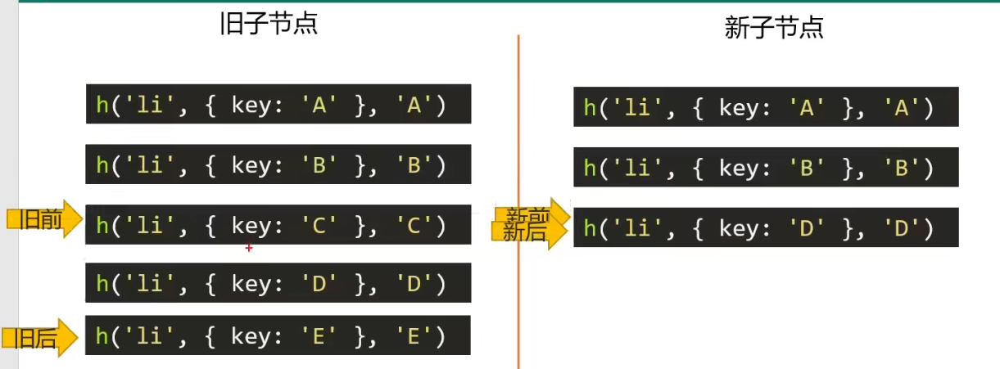

# snabbdom

snabbdom是瑞典语单词，单词原意“速度”;

snabbdom是著名的虚拟DOM库，是diff算法的鼻祖，**Vue源码借鉴了snabbdom**;

官方git: https://github.com/snabbdom/snabbdom

## 安装snabbdom

在git上的snabbdom源码是用Typescript写的，git上并不提供编译好的JavaScript版本

如果要直接使用build出来的JavaScript版的snabbdom库，可以从npm上下载

```
npm i -D snabbdom
```

==在安装的包文件夹中 src下是ts源码， build下是js源码==。

## 测试环境搭建

- snabbdom库**是DOM库**，**不能在nodejs环境运行**，所以需要搭建webpack和webpack-dev-server开发环境，不需要安装任何loader

- 这里需要注意，必须安装最新版webpack@5，不能安装webpack@4，这是因为webpack4没有读取身份证中exports的能力，建议大家使用这样的版本【==最新版的snabbdom中并没有exports,所以这里可以将cli和server版本改为4==】

- ```
  npm i webpack@5 webpack-cli@3 webpack-dev-server@3
  
  -----现在这样安装--
  npm i -D webpack@5 webpack-cli@4 webpack-dev-server@4
  ```


### webpack.config.js基础配置

```js
const path = require('path');
module.exports = {
    mode: 'development',
    entry: './src/index.js',
    output: {
        // path: path.resolve(__dirname, 'dist'),
        //使用的publicPath,文件夹不会真正生成，而是在8080端口虚拟生成
        publicPath: '/xuNi/',
        filename: 'bundle.js',
    },
    devServer: {
        //端口号
        port: 8080,
        //静态资源文件夹 contentBase:'www' --现在使用 static: 'XXX'
        static: 'www'
    },
    //Webpack 默认只会解析['.js', '.json', '.wasm']这三种格式的文件,
    //如果需要让 Webpack 支持ts,需要加上extensions的配置
    //当文件中包含ts文件时需要加上以下代码，如还不可以这次运行则需要删除依赖，重新安装
    resolve: {
        extensions: ['.ts', '.js', '.less']
    },

};
```

## 虚拟DOM

==DOM变为虚拟DOM属于**模板编译原理**==。


### diff发生在虚拟DOM上

==新虚拟DOM和老虚拟DOM进行diff (精细化比较)，算出应该如何最小量更新，最后反映到真正的DOM==。

## h函数

### h函数用来产生虚拟节点

==h函数用来产生**虚拟节点 (vnode)**==：如以下调用h函数

```js
h('a',{props:{href:'http://www.atguigu.com'}},'尚');
```

将得到：

```js
{"sel":"a","data":{ props: {href: 'http://www.atguigu.com'}},"text":"尚")
```

表示真正的节点

```html
<a href='http://www.atguigu.com'>尚</a>
```

### 虚拟节点的属性

```js
{
    children: undefined   //虚拟节点的子元素
    data: {}              //虚拟节点的属性、样式等
    elm: undefined        //对应的真正的DOM节点,undefined表示这个虚拟节点还没有上树
    key: undefined       //key表示这个虚拟节点的唯一标识
    sel:"div"            //表示选择器
    text:"我是一个盒子     //表示文字或者说是标签中间的内容 <a>这里的内容</a>，所以还可以是其他的标签【可用于嵌套】
}
```


### 虚拟节点上树

```js
import {
    init,
    classModule,
    propsModule,
    styleModule,
    eventListenersModule,
    h,
} from "snabbdom";

// 创建patch函数【diff算法的核心函数】，用于将虚拟节点显示在页面上【虚拟节点上树】
const patch=init([classModule,propsModule,styleModule,eventListenersModule])

//创建虚拟节点,此时并不会在页面上真正的产生a标签
var myVnNode=h('a',{props:{href:'http://www.hao123.com',target:'_blank'}},'guo')

//使虚拟节点上树,一个容器只能让一个虚拟节点上树，除非有内嵌
const container=document.getElementById('container')
patch(container,myVnNode)
```

### h函数嵌套使用，得到虚拟DOM树【重要】

如以下嵌套使用h函数:

```js
h('ul',{},[
    h('li',{},'牛奶'),
    h('li',{},'咖啡')
])  
//  如果只有一个子元素数组符号可以省略
h('ul',{},h('li',{},'牛奶'))  
```

将得到以下虚拟DOM树：

```js
{
    'sel':'ul',
    'data':{},
    'children':[
        {'sel':'li','text':'牛奶'},
        {'sel':'li','text':'咖啡'},
    ]
}
```

### 手写h函数【主干部分】

这里只实现如下三种情况：【也就是要求必须接受三个参数，不考虑其他的传参情况了】

```ts
h(sel,data,[])
h(sel,data,'文字')
h(sel,data,h())
```

#### myVnode

```js
//该函数的功能仅仅是传入的参数组合成对象，返回即可
export default function(sel,data,children,text,elm){
      let key=data.key
      return {
        sel,data,children,text,elm,key
      }
}
```

#### myH函数

```js
import myVnode from "./myVnode";

// 只考虑必传三个参数的情况
// h(sel,data,'文字')
// h(sel,data,[])
// h(sel,data,h())
export default function (sel, data, c) {
    //排除其他传参情况
    if (arguments.length != 3) {
        throw new Error('请传入三个参数')
    }
    // 检测参数c的类型
    if (typeof c == 'string' || typeof c == "number") {
        //情况一
        return myVnode(sel, data, undefined, c, undefined)
    } else if (Array.isArray(c)) {
        //情况二
        //由于在传入h函数的时候，已经执行了【也就是已经逐级向外成为了返回的对象】，因此这里只需要收集返回的对象即可
        let children = []
        c.forEach(k => {
            if (!typeof k == 'object' && !k.hasOwnProperty('sel')) {
                throw new Error('传入的数组参数中有项不是h函数')
            }
            children.push(k)
        })
        return myVnode(sel,data,children,undefined,undefined)
    } else if (typeof c == 'object' && c.hasOwnProperty('sel')) {
        //情况三
        let children=[c]
        return myVnode(sel,data,children,undefined,undefined)
    } else {
        throw new Error('传入参数不正确')
    }
}
```

#### key值的作用

**不加key值**：

==此时由于没有加上key值，<span style='color:red'>节点E将是在列表末尾插入一个节点</span>，然后将第一个节点的值换为E,第二个节点的值换为A，第三个换为B==。近乎推倒重来效率极低。

```js
const container=document.getElementById('container')
let vnode1=h('ul',{},[
    h('li',{},'A'),
    h('li',{},'B')
]) 
patch(container,vonde1)

let vnode2=h('ul',{},[
    h('li',{},'E'),
    h('li',{},'A'),
    h('li',{},'B')
]) 
//点击按钮时，将vnode1变为vnode2
btn.onclick=function(){
    patch(vonde1,vode2)
}
```

**加上key值**：

==加上key值后，为节点加上了唯一标识，patch函数将会判断出新旧树之间没有变化的节点，并正确的进行最小量更新，<span style='color:red'>此时节点E将是在列表头部插入一个节点</span>==。而没有对之后的节点重新渲染，效率更高。

```js
const container=document.getElementById('container')
let vnode1=h('ul',{},[
    h('li',{key:'A'},'A'),
    h('li',{key:'B'},'B')
]) 
patch(container,vonde1)

let vnode2=h('ul',{},[
    h('li',{key:'E'},'E'),
    h('li',{key:'A'},'A'),
    h('li',{key:'B'},'B')
]) 
//点击按钮时，将vnode1变为vnode2
btn.onclick=function(){
    patch(vonde1,vode2)
}
```

**==结论==**：

- key是这个节点的唯一标识，告诉diff算法，在更改前后它们是同一个DOM节点。

- **只有是同一个虚拟节点，才进行精细化比较**，否则就是暴力删除旧的、插入新的。

  - **延伸问题**:==**如何定义是同一个虚拟节点**==?答:**<span style='color:red'>选择器相同且key相同</span>**。

  - ```js
    let vnode1=h('ul',{},[
        h('li',{key:'A'},'A'),
        h('li',{key:'B'},'B')
    ]) 
    
    let vnode2=h('ol',{},[
        h('li',{key:'E'},'E'),
        h('li',{key:'A'},'A'),
        h('li',{key:'B'},'B')
    ]) 
    btn.onclick=function(){
        patch(vonde1,vode2)
    }
    //由于父节点的dom发生了变化，因此不再进行最小量更新，而是直接重新渲染
    ```

    

- **只进行同层比较，不会进行跨层比较**。即使是同一片虚拟节点，但是跨层，不再进行最小量更新。而是暴力删除旧的、然后插入新的。

  - ```js
    let vnode1=h('div',{},[
        h('p',{key:'A'},'A'),
        h('p',{key:'B'},'B')
    ]) 
    
    let vnode2=h('div},h('section',[
        h('p',{key:'A'},'A'),
        h('p',{key:'B'},'B')
    ])
    btn.onclick=function(){
        patch(vonde1,vode2)
    }
    //此时由于尽管节点没有变化，但是由于多了一层section父节点，还是不会进行最小量更新
    ```

    

## 手写patch函数


### createElement

```js
//真正创建节点。将vnode以及其子节点创建为DOM
export default function createElement(vnode) {
    let domNode = document.createElement(vnode.sel)
    //有子节点还是有文本
    if (vnode.text != '' && vnode.children == undefined || vnode.children.length == 0) {//内部为文本
        domNode.innerText = vnode.text
    } else if (Array.isArray(vnode.children) && vnode.children.length > 0) {
        //内部是子节点，需要递归创建节点
        vnode.children.forEach(k => {
            //创建出子节点的DOM，一旦调用createElement意味着:创建出DOM了，并且它的elm属性指向了创建出的DOM,但是还没有上树,是一个孤儿节点。
            let childrenDOM = createElement(k)
            domNode.appendChild(childrenDOM)
        })

    }
    vnode.elm = domNode
    //返回elm，elm是一个纯DOM对象
    return vnode.elm
}
```

### myPatch函数【删除插入部分】

```js
const myVnode=myH('ul',{},[
   myH('li',{},'A'),
   myH('li',{},'B'),
   myH('li',{},'C'),
])
const container=document.getElementById('container')
myPatch(container,myVnode)

//------------上方为测试用例---------
import myVnode from "./myVnode";
import createElement from "./createElement";

export default function (oldVnode, newVnode) {
    //判断传入的第一个参数，是DOM节点还是虚拟节点
    if (oldVnode.sel == '' || oldVnode.sel == undefined) {
        //传入的第一个参数是DOM节点，此时要包装为虚拟节点
        oldVnode = myVnode(oldVnode.tagName.toLowerCase(), {}, [], undefined, oldVnode)
    }

    //判断old和new是不是一个同一个节点
    if (oldVnode.key == newVnode.key && oldVnode.sel == newVnode.sel) {  //同一个节点
        
        
      //这里进行精细化比较
        
        
    } else { //不是同一个节点
        let newVnodeElm = createElement(newVnode)
        //插入到老节点之前
        if (oldVnode.elm.parentNode && newVnodeElm) {
            oldVnode.elm.parentNode.insertBefore(newVnodeElm, oldVnode.elm)
        }
        oldVnode.elm.parentNode.removeChild(oldVnode.elm)
    }
}
```

### 精细化比较【同一节点】

**当oldVnode与newVnode的sel以及key相同时【同一个节点】**：


#### 新旧节点text的不同情况

```js
export default function (oldVnode, newVnode) {
    if (oldVnode.sel == '' || oldVnode.sel == undefined) {
         //......
    }
    //判断old和new是不是一个同一个节点
    if (oldVnode.key == newVnode.key && oldVnode.sel == newVnode.sel) {  //同一个节点
        //判断新旧vnode是否是同一个对象
        if (oldVnode === newVnode) return
        //新节点有text属性
        if (newVnode.text != undefined && (newVnode.children == undefined || newVnode.children.length == 0)) {
            if (newVnode.text != oldVnode.text) {
                oldVnode.elm.innerText = newVnode.text
            }
        } else {
            //    新vnode没有text属性，有children
            if (oldVnode.children != undefined && oldVnode.children.length > 0) {
                // 老的有children，此为最复杂情况，即新老都有children

            } else {
                //老的没有children
            }
        }

    } else { //不是同一个节点
    }
}
```

#### 新节点有children旧节点没有

```js
export default function (oldVnode, newVnode) {
    //判断传入的第一个参数，是DOM节点还是虚拟节点
    if (oldVnode.sel == '' || oldVnode.sel == undefined) {
          //......
    }

    //判断old和new是不是一个同一个节点
    if (oldVnode.key == newVnode.key && oldVnode.sel == newVnode.sel) {  //同一个节点
        //判断新旧vnode是否是同一个对象
        if (oldVnode === newVnode) return
        //新节点有text属性
        //......
        } else {
            //    新vnode没有text属性，有children
            if (oldVnode.children != undefined && oldVnode.children.length > 0) {
                // 老的有children，此为最复杂情况，即新老都有children

            } else {
                //老的没有children
                oldVnode.elm.innerHTML=''
                newVnode.children.forEach(k => {
                    let dom = createElement(k)
                    oldVnode.elm.appendChild(dom)
                })
            }
        }

    } else { //不是同一个节点
          //......
            }
}
```

#### myPatchVnode函数

将同一个节点的处理方法提炼出来作为myPatchVnode函数，用于递归处理同一节点的情况

```js
export default function myPatchVnode(oldVnode,newVnode) {
    newVnode.elm=oldVnode.elm
    //判断新旧vnode是否是同一个对象
    if (oldVnode === newVnode) return
    //新节点有text属性
    if (newVnode.text != undefined && (newVnode.children == undefined || newVnode.children.length == 0)) {
        if (newVnode.text != oldVnode.text) {
            oldVnode.elm.innerText = newVnode.text
        }
    } else {
        //    新vnode没有text属性，有children
        if (oldVnode.children != undefined && oldVnode.children.length > 0) {
            // 老的有children，此为最复杂情况，即新老都有children

        } else {
            //老的没有children
            oldVnode.elm.innerHTML = ''
            newVnode.children.forEach(k => {
                let dom = createElement(k)
                oldVnode.elm.appendChild(dom)
            })
            // oldVnode.elm.appendChild(createElement(newVnode.children))
        }
    }
}
```

#### 新旧节点都有children

##### 四种命中查找方式

四种命中查找:

1. **新前**与**旧前**。
2. **新后**与**旧后**。
3. **新后**与**旧前**。【此种命中了，涉及移动节点，将旧前指向的节点，移动到旧后之后，同时设置旧前指向的节点undefined的标记(==即不再参与命中==)】
4. **新前**与**旧后**。【此种命中了，涉及移动节点，那么旧后指向的节点，移动到旧前之前，，同时设置旧后指向的节点undefined的标记(==即不再参与命中==)】

新前：新的虚拟节点当中==没有处理的开头==的节点

新后：新的虚拟节点当中==没有处理的结尾==的节点

旧前、旧后同理

**注意**：

- <span style=color:red>命中规则是**从 1 到 4 依次命中的**，命中了某一条规则时，会首先进行该套规则下的节点移动，再重新从规则 1 开始继续依次尝试命中，直到下一次没有命中时，才会去尝试命中下一条规则，若四种规则都没有命中则开始**循环**</span>。
- 在四种命中查找中，前指针只会后移，后指针只会前移。
- 四种命中查找循环的条件是：**新前<=新后&&旧前<=旧后**
- <span style=color:red>都没有命中时的循环规则为：在老节点中，命中与新前节点相同的节点，并将命中的节点的DOM移动到旧前节点之前</span>

##### 新增的情况



图中情况是在就节点末尾新增了两个节点。首先，**新前与旧前**，A与A相同，两个指针都下移，B与B，C与C都相同，“新前”移动到了D，“旧前”移动到了“旧后”的下边:



旧前>旧后，不满足循环条件，**旧节点先结束循环**，说明新节点中有剩余的节点没有被遍历，**新前与新后之间的所有节点都是要新增的节点**，此时将这些节点插入到DOM当中即可
D和E还没有被扫描，循环就结束了，说明DE就是新增的节点

##### 删除的情况



图中为在旧节点删除了一个节点c，首先，**新前与旧前**，A与A相同，两个指针都下移，B与B相同，“新前”移动到了D，“旧前”移动到了C:



此时，旧前与新前无法命中，开始**旧后与新后**，两个指针都上移，旧后移动到了旧前的位置，新后移动到了B,在新前之前:



新前>新后，不满足循环条件，**新节点先结束循环**，说明旧节点中有剩余的节点没有被命中，**旧前与旧后之间的所有节点都是要删除的节点**，此时将这些节点在DOM当中删除即可

C还没有被命中，循环就结束了，说明C就是删除的节点

##### 多删除的情况



图中为在旧节点删除了一个位于中间的节点C以及末尾的节点E，首先，**新前与旧前**，A与A相同，两个指针都下移，B与B相同，“新前”移动到了D，“旧前”移动到了C:



此时，旧前与新前无法命中，开始**旧后与新后**，由于旧后指向E,新后指向D,因此旧后与新后无法命中，开始**新后与旧前**，又由于新后指向D,旧前指向C,因此也无法命中，开始**旧后与新前**，由于旧后指向E,新前指向D,因此**四种命中规则都未能继续命中**，**==开始循环==**。

具体操作就是：新节点当前排查到了D，于是在旧节点中循环遍历，找到了D，就把旧D标为undefined【标的是虚拟D节】，旧D的DOM实际要移动到的位置为所有未处理的节点之前（C的前边），由于新前命中了，再然后“新前”下移，新前>新后了，循环结束。此时，“旧前”与“旧后”之间的节点就是没有处理过的节点（C、E），删除。


#### myUpdateChildren函数

```js
import myPatchVnode from './myPatchVnode'
import createElement from './createElement';

export default function myUpdateChildren(parentElm, oldChildren, newChildren) {

    let oldStartPointer = 0;                     // 旧前指针
    let oldEndPointer = oldChildren.length - 1;  // 旧后指针
    let newStartPointer = 0;                     // 新前指针
    let newEndPointer = newChildren.length - 1;  // 新后指针

    let oldStartVnode = oldChildren[oldStartPointer];   // 旧前节点
    let oldEndVnode = oldChildren[oldEndPointer];       // 旧后节点
    let newStartVnode = newChildren[newStartPointer];   // 新前节点
    let newEndVnode = newChildren[newEndPointer]        // 新后节点

    let keyMap = null


    while (oldStartPointer <= oldEndPointer && newStartPointer <= newEndPointer) {
        //遇见被标记为undefined虚拟节点时，直接跳过

        if (oldStartVnode == undefined|| oldChildren[oldStartPointer] === undefined) {
            oldStartVnode = oldChildren[++oldStartPointer]
        } else if (oldEndVnode == undefined || oldChildren[oldEndPointer] === undefined) {
            oldEndVnode = oldChildren[--oldEndPointer]
        } else if (newStartVnode == undefined || newChildren[newStartPointer] === undefined) {
            newStartVnode = newChildren[++newStartPointer]
        } else if (newEndVnode == undefined || newChildren[newEndPointer] === undefined) {
            newEndVnode = newChildren[--newEndPointer]
        } else if (checkSameVnode(newStartVnode, oldStartVnode)) {   //新前与旧前 指针指向的节点是同一个节点【是否命中】，则开始精细化对比
            console.log('新前与旧前1');
            myPatchVnode(oldStartVnode,newStartVnode)
            newStartVnode = newChildren[++newStartPointer]    //新前下移
            oldStartVnode = oldChildren[++oldStartPointer]    //旧前下移       
        }  //新后与旧后
        else if (checkSameVnode(newEndVnode, oldEndVnode)) {
            console.log('新后与旧后2');
            myPatchVnode( oldEndVnode,newEndVnode)
            newEndVnode = newChildren[--newEndPointer]    //新后上移
            oldEndVnode = oldChildren[--oldEndPointer]    //旧后上移         
        }  //新后与旧前
        else if (checkSameVnode(newEndVnode, oldStartVnode)) {
            console.log('新后与旧前3');
            myPatchVnode(oldStartVnode,newEndVnode)
            // 移动节点，将旧前指向的节点，移动到旧后之后
            parentElm.insertBefore(oldStartVnode.elm, oldEndVnode.elm.nextSibling)

            newEndVnode = newChildren[--newEndPointer]    //新后上移
            oldStartVnode = oldChildren[++oldStartPointer]    //旧前下移     
        } //新前与旧后
        else if (checkSameVnode(newStartVnode, oldEndVnode)) {
            console.log('新前与旧后4');
            myPatchVnode(oldEndVnode,newStartVnode)
            // 移动节点，将旧后指向的节点，移动到旧前之前
            parentElm.insertBefore(oldEndVnode.elm, oldStartVnode.elm)
            newStartVnode = newChildren[++newStartPointer]    //新前下移
            oldEndVnode = oldChildren[--oldEndPointer]    //旧后上移     
        } else {
            //全都没有命中
            console.log('全未命中');
            //寻找旧节点中key与index的map，用于寻找新前节点是否为新增，以及插入位置
            if (!keyMap) {
                keyMap = {}
                for (let i = oldStartPointer; i <= oldEndPointer; i++) {
                    const key = oldChildren[i].key
                    if (key != undefined) {
                        keyMap[key] = i
                    }
                }
            }
            //    寻找新前节点在旧节点的keyMap中的映射的位置序号
            const idxInOld = keyMap[newStartVnode.key]
            //如果inxInOld是undefined表示它是全新的项,不是则需要移动
            if (idxInOld == undefined) {
                //创建新前节点的DOM并将该项移动至旧前节点的DOM之前
                parentElm.insertBefore(createElement(newStartVnode), oldStartVnode.elm)
            } else {
                const elmToMove = oldChildren[idxInOld]   //获取老节点中与新前节点对应的节点，用于移动      
                myPatchVnode(elmToMove, newStartVnode)
                oldChildren[idxInOld] = undefined
                parentElm.insertBefore(elmToMove.elm, oldStartVnode.elm)
            }
            newStartVnode = newChildren[++newStartPointer]

        }
    }


    //循环结束
    if (newStartPointer <= newEndPointer) { //循环结束后新前仍旧小于新后，说明有节点需要插入
        for (let i = newStartPointer; i <= newEndPointer; i++) {
            const before=newChildren[newEndPointer+1]==null?null:newChildren[newEndPointer+1].elm;
            console.log(before);
            parentElm.insertBefore(createElement(newChildren[i]), before)
        }
    } else if (oldStartPointer <= oldEndPointer) {  //循环结束后旧前仍旧小于旧后，说明有节点需要删除
        for (let i = oldStartPointer; i <= oldEndPointer; i++) {
            oldChildren[i] && parentElm.removeChild(oldChildren[i].elm)
        }
    }
}

//判断是否为同一个节点
function checkSameVnode(a, b) {

    return a.sel == b.sel && a.key == b.key
}
```

测试数据index.js

```js
import myH from "./mySnabbdom/myH";
import myPatch from "./mySnabbdom/myPatch";


const container = document.getElementById('container')
const btn = document.getElementById('btn')

let vnode1 = myH('ul', {}, [
   myH('li', { key: 'A' }, 'A'),
   myH('li', { key: 'B' }, 'B'),
   myH('li', { key: 'C' }, 'C'),
   myH('li', { key: 'D' }, 'D'),
   myH('li', { key: 'E' }, 'E'),
])

let vnode2 = myH('ul', {}, [

   myH('li', { key: 'V' }, 'V'),
   myH('li', { key: 'E' }, 'E'),
   myH('li', { key: 'O' }, 'O'),
   myH('li', { key: 'D' }, 'D'),
   myH('li', { key: 'C' }, 'C'),
   myH('li', { key: 'QQQ' }, 'QQQ'),
   myH('li', { key: 'B' }, 'B'),
   myH('li', { key: 'A' }, 'A'),
])

myPatch(container, vnode1)

btn.onclick = function () {
   myPatch(vnode1, vnode2)
}


```

